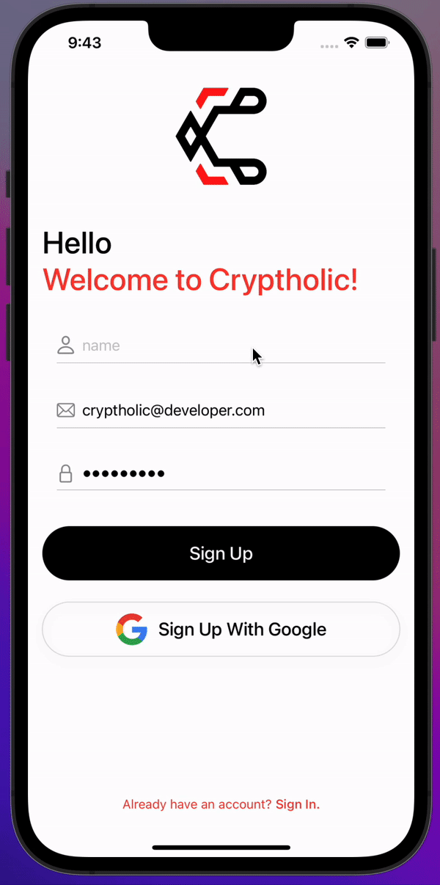
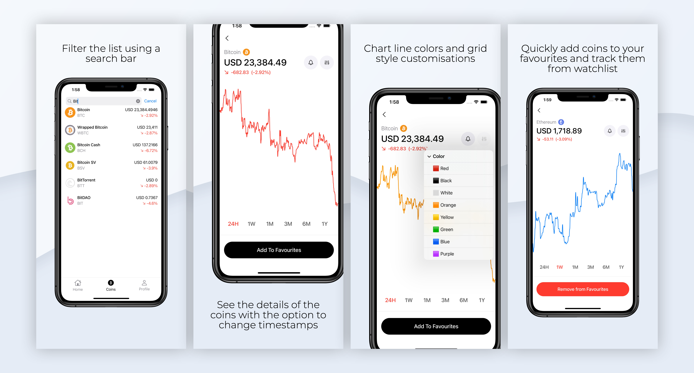
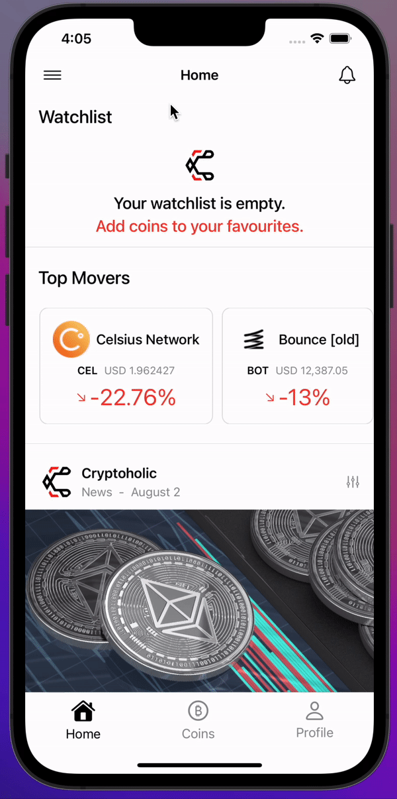
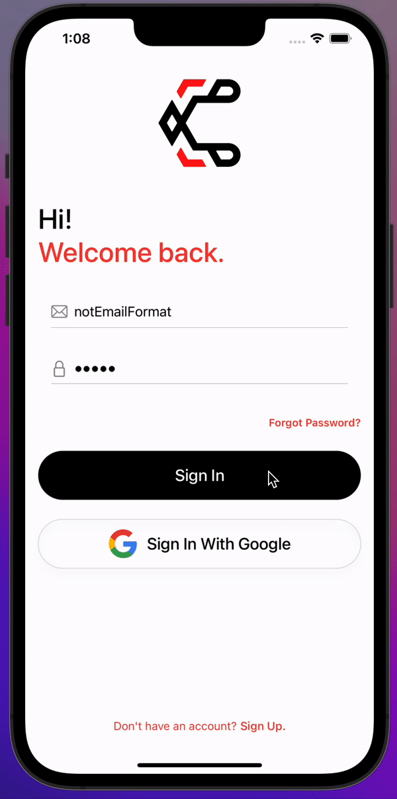
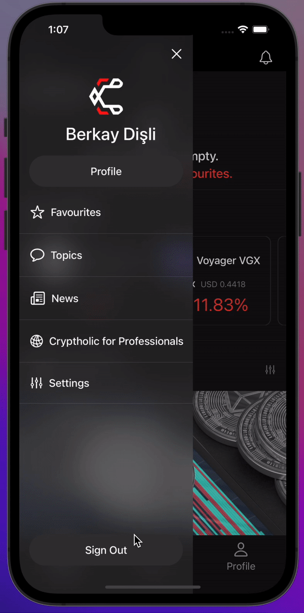
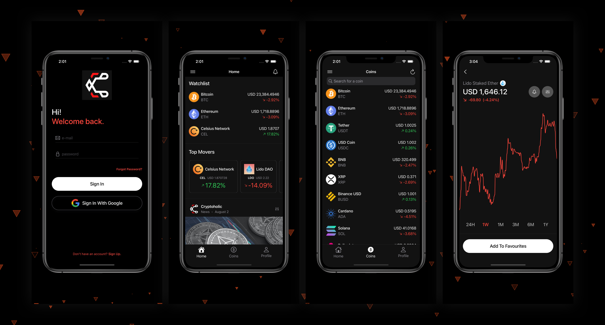
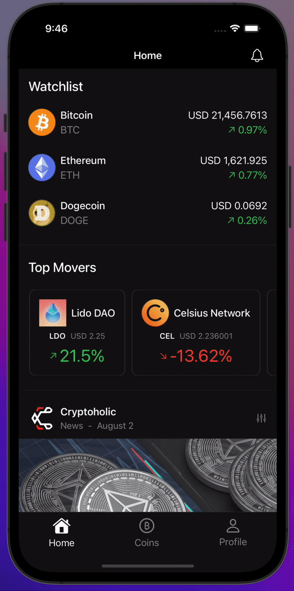

# Cryptholic 

  

**A crypto tracking app.**

*Work in progress...*

## Architecture
- SwiftUI and MVVM
- API Calls Providing Coin Info's
- Search Bar Using SwiftUI's **Searchable** Property
- Custom Scroll View with **Pull to Refresh** Function
- Sorting and Filtering Data Based On Certain Stats
- Fully Adjustable Custom Tab Bar
- Clean Structure with Reusable Components
- Beautiful Animations and Smooth Transitions
- **SwiftUICharts** for Coin Price Visualisation
- **Kingfisher** for Async Image Downloading and Caching

 
# Cryptholic - Features

## Authentication

  

 

     

- Firebase Authentication
- Google Sign In
- Providing Email/Password Authentication
- Remember the User Feature

## Coins Showcase

  

 

    

- Filtering the Coin List w/ SwiftUI's **Searchable**
- Coin Details Page with **Price Info** and **Data Visualisation**
- Multiple Timestamps Support for Better Analysis
- Fully Customisable LineChart with Multiple **Line Color** Options and **Grid Feature**
- Add Coins to Your **Favourites** and Track Them From Your Watchlist

## Side Menu - New Designs
 

    

## Alerts

    

- Alert Messages From FirebaseAuth
- Sign Out Button Alerts to Prevent Logging Out by Mistake

## Dark Mode 

  

 

    

- Dark Mode Matches Your System Scheme
- UI is Re-Designed for Dark Scheme
- Side Menu is Now Transparent

